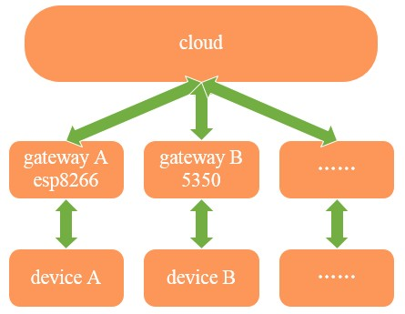
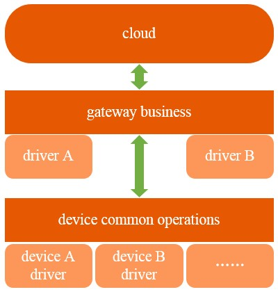

##pando-embedded-framework
#introduction
When connecting a hardware device to the internet, we need a cloud, a device, and a gateway. We have to code in the device to get the data of the real word by hardware driver, code in the gateway to connect our device to the cloud and send data to the cloud by network, code in the cloud to deal with the business. We have to do so much, on the other hand, because of the variety of gateway and device, we have to implement the save business on different platform, such as, esp8266, 5350, stm32, ardunio, and so on.  
The structure of conneting things to the internet is like below:    
  
pando-embedded-framwork is different in that, it abstracts the common gateway business, such as register, login, access, and so on, leave the driver interface to be implemented on different platform; on the other hand, it abstracts the device common operations.  
  
#directory structure  
    -doc
    -framework
             |-gateway
             |-lib
             |-platform
                      |-include
                      |-src
                          |-stm32
             |-protocol
             |-subdevice
	-example
           |-stm32

`doc`:the document.   
`gateway`:the common gateway business.   
`lib`:the library used.   
`include`:the function declarations used in the framework, which should be implemented in different platforms.   
`src`:contains the implementation of the interface in `include` for different platforms.  
`subdevice`:the abstractation of device common operation.   
`example`:because of that this framework is a library, so `example` contains base initialization and main function to run.   
#how to
If you want to use this framework in your own project, what you need to do is to implement the interface in `include` directory, and to add your own devices which are defined in `subdevice`. We will offer examples for you to refer to.   
If you want to know more about the whole framework, you can follow the project [pando-cloud](https://github.com/PandoCloud/pando-cloud) to learn about the cloud. And the project [tisan-kit](https://github.com/tisan-kit) contains more examples about the framework by our development board `tisan`.   
We also appreciate you to share your implementation on your platform or improve this framework. If you want to do so, there is [a coding style](doc/coding-style.md) for you to read first in order to cooperate better. 
#Example 
[stm32+3G](doc/eg-stm32-3g.md) 
[esp8266](doc/eg-esp8266.md)
